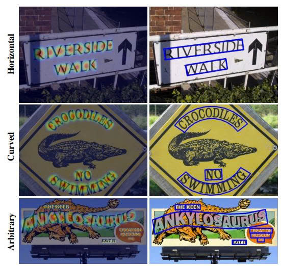
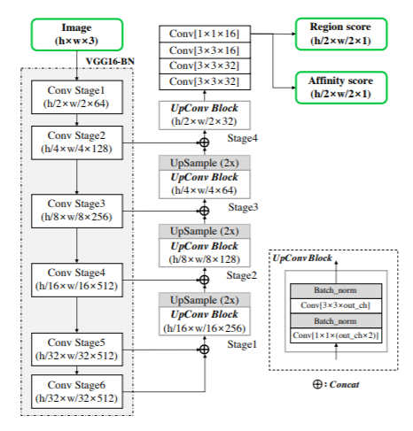
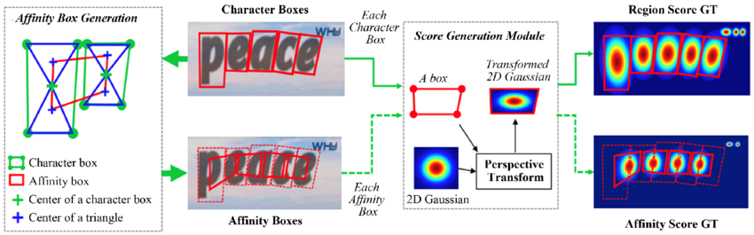
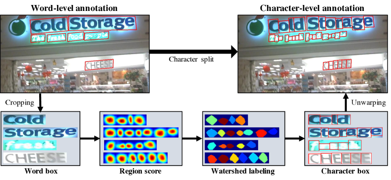
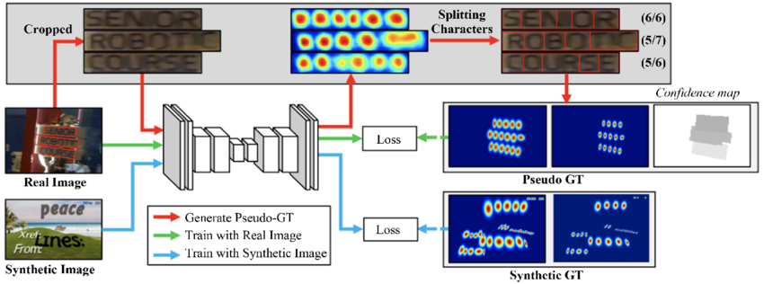
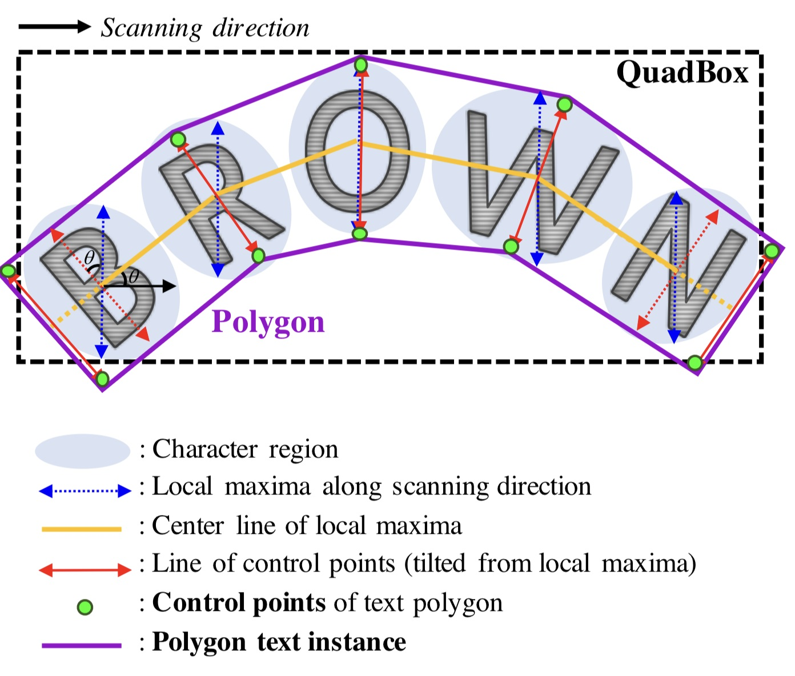
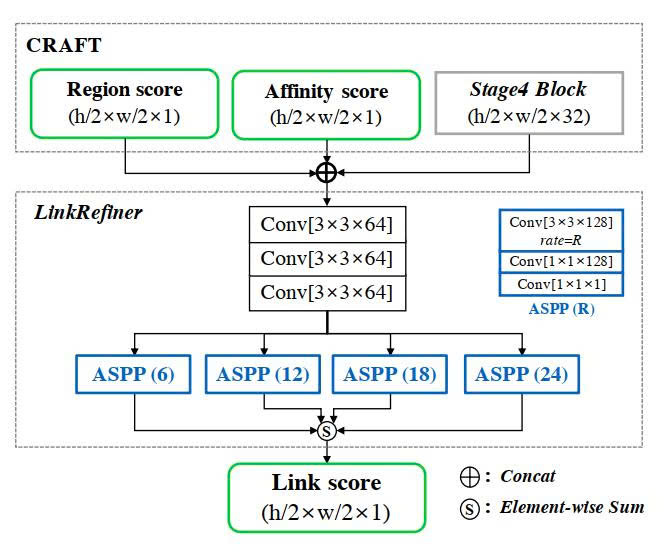

# CRAFT

**CRAFT (Character Region Awareness for Text detection)** ra đời năm 2019 với một mục tiêu chính là phát hiện văn bản trong ảnh một cách chính xác và hiệu quả. Khác biệt hoàn toàn với tư duy **bounding box regression**, dự doán hộp bao cứng nhắc như **EAST**, CRAFT tiếp cận vấn đề theo hướng **bottom-up** (từ dưới lên) thông qua việc nhận thức từng ký tự riêng lẻ và mối quan hệ liên kết giữa chúng.

Thay vì cố gắng học một hình tứ giác bao trọn toàn bộ dòng văn bản ngay từ đầu (một tác vụ cực kỳ khó khăn khi văn bản bị cong, biến dạng hoặc cực dài), CRAFT chia nhỏ bài toán thành hai nhiệm vụ con có tính chất cục bộ hơn:
* **Character Region**: Định vị từng ký tự 
* **Affinity**: Dự đoán xác suất liên kết giữa các ký tự liền kề

Phương pháp này giúp mô hình đạt được **độ linh hoạt hình học** (geometric flexibility) vượt trội, cho phép biểu diễn các văn bản có hình thù phức tạp mà các phương pháp truyền thống thường thất bại

  

## Kiến trúc tổng quan
Kiến trúc mạng của CRAFT được xây dựng dựa trên nền tảng **Fully Convolutional Network**, lấy cảm hứng từ kiến trúc **U-Net** nổi tiếng trong bài toán **phân đoạn y tế**. Thiết kế này cho phép mô hình bảo toàn thông tin ngữ nghĩa cấp cao (để nhận biết đâu là văn bản) đồng thời khôi phục lại chi tiết không gian cấp thấp (để phân tách chính xác ranh giới các ký tự)

### 1. Feature Extractor Stem
Phần khung xương của CRAFT chịu trách nhiệm trích xuất các đặc trưng thị giác từ ảnh đầu vào là **VGG-16** với **Batch Normalization** (VGG16-BN) làm bộ trích xuất đặc trưng cơ sở

#### Tại sao là VGG16-BN? 
Mặc dù các mạng **ResNet** thường được ưa chuộng trong các bài toán nhận diện đối tượng hiện đại, VGG16 được lựa chọn cho CRAFT vì **cấu trúc chuỗi thẳng** (plain chain) của nó giúp **bảo toàn thông tin không gian** (spatial fidelity) tốt hơn ở các tầng nông, điều này cực kỳ quan trọng đối với việc phát hiện các đối tượng **nhỏ và dày đặc** như ký tự văn bản. Batch Normalization được tích hợp vào các khối tích chập để giải quyết vấn đề biến mất gradient (vanishing gradient) và tăng tốc độ hội tụ trong quá trình huấn luyện

#### Cơ chế trích xuất
* Mạng nhận đầu vào là ảnh màu (RGB) với kích thước linh hoạt, nhưng thường được **chuẩn hóa** về cạnh dài (ví dụ: 1280px) để đảm bảo tính nhất quán của trường cảm thụ (receptive field)
* Các khối tích chập (Stage 1 đến Stage 5) thực hiện việc giảm dần độ phân giải không gian và tăng chiều sâu kênh (channel depth)
* Các tầng Max Pooling xen kẽ giúp mở rộng trường cảm thụ, cho phép mạng nhìn thấy các ngữ cảnh rộng hơn (ví dụ: một dòng chữ dài) thay vì chỉ các nét đơn lẻ

#### Đặc trưng đa tầng
Tương tự như EAST, CRAFT không chỉ sử dụng đặc trưng từ tầng cuối cùng (Stage 5) mà còn tận dụng các đặc trưng trung gian từ các Stage thấp hơn thông qua các kết nối bỏ qua (skip connections), chuẩn bị cho nhánh hợp nhất đặc trưng

  

### 2. Feature-Merging Branch
Đây là thành phần **cốt lõi** giúp CRAFT khôi phục lại độ phân giải không gian để tạo ra score map chi tiết. Nhánh này hoạt động theo cơ chế giải mã (decoding) tương tự như phần "Up-sampling path" của U-Net

#### Cơ chế tổng hợp U-Net:
* Các đặc trưng từ tầng sâu nhất (có tính trừu tượng cao nhưng độ phân giải thấp, ví dụ: $\frac{H}{32} \times \frac{W}{32}$) được **phóng to** (upsample) thông qua các lớp UpConv
* Tại mỗi bước phóng to, bản đồ đặc trưng được nối (concatenated) với bản đồ đặc trưng tương ứng từ nhánh Encoder (VGG16 backbone). Ví dụ, đặc trưng sau khi upsample từ Stage 5 sẽ được ghép với đặc trưng từ Stage 4. Cấu trúc này cho phép mạng **kết hợp** thông tin ngữ nghĩa toàn cục ("đây là một vùng văn bản") với thông tin chi tiết cục bộ ("đây là biên của ký tự 'A'")

#### Cấu hình chi tiết:
* Nhánh giải mã bao gồm một chuỗi các khối tích chập $1 \times 1$ và $3 \times 3$ để trộn thông tin sau khi ghép kênh
* Quá trình này lặp lại cho đến khi khôi phục được bản đồ đặc trưng có kích thước bằng $\frac{1}{2}$ kích thước ảnh gốc ($\frac{H}{2} \times \frac{W}{2}$). Tỷ lệ này là sự cân bằng tối ưu giữa chi phí tính toán và độ chi tiết cần thiết để phân tách các ký tự đứng sát nhau

### 3. Output Layer
Khác với EAST xuất ra các bản đồ hình học phức tạp (khoảng cách đến 4 cạnh, góc xoay), tầng đầu ra của CRAFT cực kỳ **đơn giản và thanh thoát**, chỉ bao gồm 2 score maps:

#### Score Map (Region Score)
* Kênh đầu tiên là **Region Score**, là **xác suất** để một pixel bất kỳ nằm tại **trung tâm** của một ký tự
* **Bản chất Heatmap**: Thay vì sử dụng **mặt nạ nhị phân** (0/1) cứng nhắc, CRAFT sử dụng **phân phối Gaussian** (Isotropic Gaussian) để mô hình hóa vùng ký tự. Giá trị pixel đạt cực đại (tiến tới 1) tại tâm ký tự và giảm dần về 0 khi ra xa tâm
* **Ưu điểm**: Cách biểu diễn bằng Heatmap Gaussian giúp mô hình học được tính chất **liên tục** của không gian và tách biệt tốt hơn các ký tự dính liền. Trong các phương pháp phân đoạn nhị phân truyền thống, hai ký tự sát nhau (như 'rn') thường bị dự đoán dính thành một **vùng liên thông** (blob) duy nhất, gây khó khăn cho việc tách rời. Heatmap giúp duy trì các đỉnh (peaks) riêng biệt cho từng ký tự ngay cả khi chân của phân phối Gaussian chồng lấn nhau

#### Affinity Map (Affinity Score)
* Kênh thứ hai là **Affinity Score**, là xác suất một pixel nằm tại trung tâm của **"liên kết"** giữa hai ký tự liền kề
* **Khái niệm "Keo dính"**: Vùng Affinity không phải là một **thực thể vật lý** trên ảnh (không có nét mực ở giữa các chữ cái), mà là một **khái niệm trừu tượng** biểu thị mối quan hệ thuộc về cùng một từ. Nó đóng vai trò như "keo dính" để **ghép** các ký tự rời rạc lại với nhau
* **Vai trò hình học**: Nhờ có Affinity Map, CRAFT không cần quan tâm đến **hình dạng tổng thể** của từ (thẳng, cong hay méo). Miễn là các ký tự liền kề có **liên kết mạnh**, thuật toán **hậu xử lý** sẽ xâu chuỗi chúng lại thành một đường dẫn (path) chính xác. Điều này **giải quyết triệt để** vấn đề văn bản cong mà các mô hình hồi quy hộp chữ nhật (như EAST RBOX) gặp phải   

### 4. Ground Truth Label Generation
Điểm độc đáo nhất trong **chiến lược huấn luyện** của CRAFT là khả năng học từ **dữ liệu nhãn yếu** (Weakly-supervised Learning). Do hầu hết các bộ dữ liệu thực tế (như ICDAR2015, MLT) chỉ cung cấp nhãn ở **cấp độ từ** (Word-level annotation) chứ không có **cấp độ ký tự**, CRAFT phải tự **"suy luận"** ra vị trí của chúng. Quy trình tạo nhãn (Ground Truth Generation) cụ thể:

#### Với dữ liệu tổng hợp (Synthetic Data): 
Sử dụng bộ dữ liệu SynthText với khoảng 800,000 ảnh tổng hợp có sẵn tọa độ từng ký tự trong từ 
* **Region Map**: Với mỗi hộp ký tự, hệ thống tính toán ma trận **biến đổi phối cảnh** (Perspective Transform) để warp một bản đồ Gaussian 2D chuẩn vào **khớp** với hộp ký tự đó 
* **Affinity Map**: Hệ thống xác định các **cặp ký tự liền kề** trong cùng một từ. Vẽ hai hình tam giác nối tâm của hai ký tự (tạo thành hình nơ hoặc hình tứ giác chéo). Vùng **Affinity Box** được xác định bởi tâm của các tam giác này, sau đó cũng được phủ một lớp **Gaussian heatmap**

  

#### Với dữ liệu thực (Real-world Data):
Sử dụng cơ chế giám sát yếu:
* **Bước 1 (Crop & Predict)**: Cắt ảnh các từ từ ảnh gốc dựa trên nhãn word-level. Sử dụng mô hình CRAFT **hiện tại** (Interim Model - đang được huấn luyện) để dự đoán Region Score trên các ảnh crop này
* **Bước 2 (Watershed Splitting)**: Vì dự đoán ban đầu có thể bị dính, **thuật toán Watershed** được áp dụng để phân tách các vùng ký tự dựa trên các đỉnh (peaks) của heatmap
* **Bước 3 (Pseudo-GT Generation)**: Các vùng ký tự sau khi tách sẽ được coi là **"nhãn giả"** (Pseudo-Ground Truth). Hệ thống lại **áp dụng quy trình** warp Gaussian để tạo ra bản đồ Region và Affinity nhãn giả cho lần huấn luyện tiếp theo

  

**Kiểm soát chất lượng**: Để tránh việc mô hình học sai từ các nhãn giả **kém chất lượng**, độ dài từ (số lượng ký tự) được dùng làm **tham chiếu**. Nếu số lượng vùng ký tự tách được khác xa với độ dài thực tế của từ (ví dụ: từ "Apple" có 5 ký tự nhưng chỉ tách được 3 vùng), **trọng số tin cậy** của mẫu này sẽ bị giảm thấp   

## Hàm mất mát
Hàm mất mát (Loss Function) của CRAFT được thiết kế để **tối ưu hóa sự khác biệt** giữa Heatmap dự đoán và Heatmap nhãn (Ground Truth hoặc Pseudo-GT) trên từng pixel. Do đầu ra là **giá trị xác suất liên tục**, hàm Mean Squared Error (MSE) được sử dụng thay vì Cross-Entropy

### Loss cho Score Map ($L_s$)
Hàm loss tổng quát được định nghĩa dựa trên **sự sai khác bình phương** (L2 distance) tại từng pixel, có tính đến **trọng số tin cậy** (Confidence Score):

$$L = \sum_{p} S_c(p) \cdot \left( ||S_r^{\text{pred}}(p) - S_r^{\text{real}}(p)||_2^2 + ||S_a^{\text{pred}}(p) - S_a^{\text{real}}(p)||_2^2 \right)$$

Trong đó:
* $p$: Vị trí pixel trên bản đồ đặc trưng
* $S_r^{\text{pred}}(p)$ và $S_r^{\text{real}}(p)$: Region Score dự đoán và nhãn thực tế
* $S_a^{\text{pred}}(p)$ và $S_a^{\text{real}}(p)$: Affinity Score dự đoán và nhãn thực tế
* $S_c(p)$: Bản đồ trọng số tin cậy (Confidence Map)

### Confidence Map ($S_c$)
Thành phần $S_c(p)$ đóng vai trò **cực kỳ quan trọng** trong cơ chế giám sát yếu. Nó hoạt động như một **"bộ lọc"** để bảo vệ mô hình khỏi các dữ liệu nhiễu
* **Công thức tính độ tin cậy**: Với một từ $w$, độ tin cậy $s_{conf}(w)$ được tính dựa trên sự sai lệch giữa độ dài từ thực tế $l(w)$ và số lượng ký tự dự đoán được $l^c(w)$:

$$s_{conf}(w) = \frac{l(w) - \min(l(w), |l(w) - l^c(w)|)}{l(w)}$$

* **Ý nghĩa**: 
  * Nếu mô hình tách đúng số lượng ký tự ($l^c = l$), thì $s_{conf} = 1$. Mẫu dữ liệu này đóng góp hoàn toàn vào quá trình học
  * Nếu sai lệch lớn (ví dụ từ 5 ký tự chỉ tách được 2), $s_{conf}$ giảm xuống gần 0. Pixel thuộc vùng từ này sẽ có trọng số loss rất nhỏ, nghĩa là mô hình sẽ **"lờ đi"** sai số tại vùng này, tránh việc cập nhật trọng số mạng dựa trên thông tin sai lệch

* **Online Hard Negative Mining (OHEM)**: Để **cân bằng** giữa lượng lớn pixel nền (background) và số lượng ít pixel văn bản, CRAFT áp dụng OHEM với **tỷ lệ 1:3**, tập trung vào các vùng mà mô hình dự đoán sai nhiều nhất

  

## Hậu xử lý
Khác với EAST sử dụng **LANMS** (Locality-Aware Non-Maximum Suppression) để lọc bớt các hộp trùng nhau, quá trình hậu xử lý của CRAFT mang **nặng tính chất hình học và tô pô** (Topology), nhằm tái tạo lại đa giác văn bản từ các **điểm nhiệt rời rạc**

### Thresholding và Labeling
Bước đầu tiên là chuyển đổi các bản đồ điểm xác suất thành các vùng liên thông:

#### Binary Map
Với mỗi pixel $p$, áp dụng ngưỡng (Thresholding) lên Region Map ($\tau_r$) và Affinity Map ($\tau_a$) để gán giá trị cho Binary Map $M$:

$$M(p) = \begin{cases} 
1 & \text{nếu } S_r(p) > \tau_r \text{ hoặc } S_a(p) > \tau_a\\
0 & \text{trong các trường hợp khác }
\end{cases}$$

#### Connected Component Labeling (CCL): 
Sử dụng thuật toán **gán nhãn thành phần liên thông** lên bản đồ nhị phân tổng hợp $M$. Kết quả là các **"blobs"** riêng biệt, mỗi blob **đại diện** cho một từ hoặc một dòng văn bản. Nhờ có Affinity Map lấp đầy khoảng trống giữa các ký tự, các ký tự trong cùng một từ sẽ **dính liền** thành một blob duy nhất

### Polygon Generation
Đây là bước **thay thế hoàn toàn** cho tư duy "hộp chữ nhật" của EAST, cho phép CRAFT **xử lý** văn bản cong hoàn hảo

  

#### Local Maxima Scanning:
* Quét dọc **theo diện tích** của blob để tìm các đường **cực đại cục bộ** (local maxima lines) của Region Score. Các đường này đại diện cho **trục xương sống** của từng ký tự
* Kết nối **trung điểm** của các đường cực đại này để tạo thành đường trung tâm (Center Line) của toàn bộ từ (thường là đường cong nếu văn bản cong)

#### Polygon Expansion:
* Tại mỗi điểm cực đại cục bộ, xác định **vectơ hướng** (tilt) của ký tự đó. Điều này quan trọng đối với văn bản in nghiêng hoặc xoay
* Xoay các đường cực đại cục bộ vuông góc với đường trung tâm để phản ánh đúng **hướng của ký tự**
* Mở rộng các **đầu mút** (endpoints) của đường cực đại ra phía ngoài một khoảng xác định để **bao trọn biên** của ký tự

#### Bounding Polygon: 
Tập hợp các điểm đầu mút đã mở rộng này tạo thành các **điểm điều khiển** (control points). Đa giác văn bản cuối cùng được tạo thành bằng cách nối các điểm điều khiển này bao quanh chuỗi ký tự. Kết quả là một **đa giác bám sát** (tight polygon) theo hình dáng của dòng chữ, bất kể nó uốn lượn thế nào

## Ví dụ minh họa
CRAFT/ 
├── config/ # Quản lý cấu hình 
│ └── config.yaml # File YAML chứa toàn bộ tham số 
├── data/ # Pipeline xử lý dữ liệu 
│ ├── init.py 
│ ├── dataset.py # Custom Dataset Class 
│ ├── gaussian.py # Sinh Heatmap
│ └── augmentations.py # Augmentation (RandomCrop, Rotate) 
├── models/ # Định nghĩa mạng nơ-ron 
│ ├── init.py 
│ ├── craft.py # Class CRAFT và vgg16_bn
│ ├── refinenet.py # LinkRefiner
│ └── weights/ 
├── utils/
  ├── init.py 
│ ├── loss.py # Hàm loss OHEM 
│ ├── metrics.py # Tính IoU, F1-score 
│ ├── post_processing.py # getDetBoxes
│ └── logger.py # Ghi log huấn luyện 
├── train.py # Script huấn luyện chính 
├── eval.py # Script đánh giá

## Nhược điểm của CRAFT
Mặc dù mang lại độ chính xác **vượt trội** và khả năng xử lý hình học **tuyệt vời**, CRAFT không phải là không có điểm yếu. Những hạn chế này chủ yếu liên quan đến chi phí tính toán và đặc thù ngôn ngữ:
### Tốc độ suy luận (Inference Speed)
Đây là sự **đánh đổi lớn nhất** của CRAFT so với sự nhanh nhẹn của EAST
* **Gánh nặng tính toán**: Backbone VGG16 có khối lượng tính toán lớn hơn nhiều so với PVANet (của EAST) hoặc ResNet. Việc duy trì độ phân giải cao ở nhánh giải mã ($\frac{H}{2}$) cũng làm tăng chi phí bộ nhớ và tính toán
* **Nghẽn cổ chai ở hậu xử lý**: Thuật toán tạo đa giác (Watershed, CCL, tìm Local Maxima) là các thao tác tuần tự trên CPU, **khó song song hóa** trên GPU. CRAFT tốn nhiều thời gian để **"vẽ"** lại đa giác từ heatmap
* **Thống kê**: Trên cùng một phần cứng (ví dụ GPU Nvidia P40), CRAFT thường chỉ đạt khoảng 8.6 FPS, trong khi EAST có thể dễ dàng đạt trên 13.2 FPS (thậm chí 50+ FPS với các phiên bản tối ưu hóa)

### Vấn đề với ngôn ngữ viết liền (Continuous Scripts)
Triết lý "Character Region" của CRAFT gặp trở ngại lớn với các hệ thống chữ viết **không phân tách ký tự rõ ràng**
* **Tiếng Ả Rập và Bangla**: Trong các ngôn ngữ này, các ký tự thường được viết **nối liền nhau** thành một dòng chảy liên tục (cursive). Khái niệm "Affinity" (khoảng cách giữa các ký tự) trở nên **mơ hồ và khó định nghĩa**. CRAFT thường thất bại trong việc tách đúng từng ký tự, dẫn đến việc Region Map bị dính chùm hoặc phân mảnh sai lệch, làm giảm độ chính xác tổng thể trên các tập dữ liệu đa ngôn ngữ

### Giới hạn trường cảm thụ (Receptive Field)
Dù sử dụng VGG16, trường cảm thụ (receptive field) của CRAFT vẫn có **giới hạn vật lý**
* **Vấn đề**: Khi gặp các ký tự có kích thước cực lớn (ví dụ: biển báo chiếm toàn bộ khung hình), receptive field tại một pixel có thể không bao quát đủ thông tin để nhận biết đó là một phần của ký tự. Điều này dẫn đến hiện tượng **"rỗng ruột"**, tức là chỉ phát hiện được biên của ký tự mà mất phần tâm, hoặc dự đoán Region Score bị phân mảnh thành nhiều mảnh nhỏ rời rạc

## Mô hình CRAFTS
Để khắc phục các nhược điểm trên và hoàn thiện quy trình, **phiên bản nâng cấp** CRAFTS (Character Region Attention For Text Spotting) đã ra đời, đánh dấu sự chuyển dịch sang mô hình **End-to-End**

### Thay đổi tư duy dự đoán
CRAFTS không chỉ dừng lại ở việc phát hiện vị trí (Detection) mà tích hợp chặt chẽ với mô hình nhận dạng (Recognition) trong một kiến trúc thống nhất
* **Chia sẻ đặc trưng**: Thay vì cắt ảnh (ROI Pooling) một cách thụ động, CRAFTS sử dụng bản đồ đặc trưng từ CRAFT để điều hướng sự chú ý (Attention) cho bộ nhận dạng.
* **Rectification**: Sử dụng thông tin hình học từ Affinity và Region để "nắn thẳng" (rectify) các vùng văn bản cong bằng biến đổi TPS (Thin-Plate Spline) trước khi đưa vào nhận dạng
* **LinkRefiner**: Đối với các bộ dữ liệu khó như CTW-1500, một mô-đun LinkRefiner được thêm vào để tinh chỉnh Affinity Map, giúp kết nối các đoạn văn bản bị đứt gãy một cách thông minh hơn dựa trên ngữ cảnh toàn cục  

  

### Lợi ích
* **Độ chính xác cao hơn**: Việc lan truyền Gradient từ loss nhận dạng ngược về loss phát hiện giúp CRAFT học được các đặc trưng tốt hơn ("nhìn để đọc" thay vì chỉ "nhìn để thấy")
* **Khắc phục điểm yếu hình học**: Cơ chế nắn chỉnh hình học giúp hệ thống đọc tốt các văn bản cong mà các bộ nhận dạng CRNN truyền thống thường bó tay.
* **Thống nhất**: Tạo ra một hệ thống OCR hoàn chỉnh (Spotting) thay vì chỉ là một công cụ phát hiện (Detection) rời rạc

## Tài liệu tham khảo
* https://arxiv.org/abs/1904.01941
* https://arxiv.org/abs/2007.09629
* https://github.com/clovaai/CRAFT-pytorch
* https://medium.com/technovators/scene-text-detection-in-python-with-east-and-craft-cbe03dda35d5