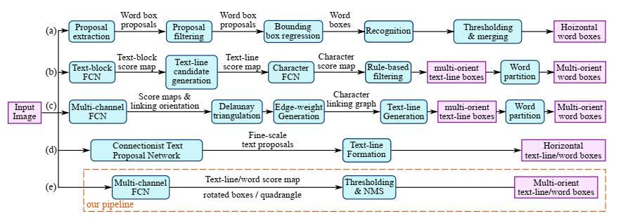
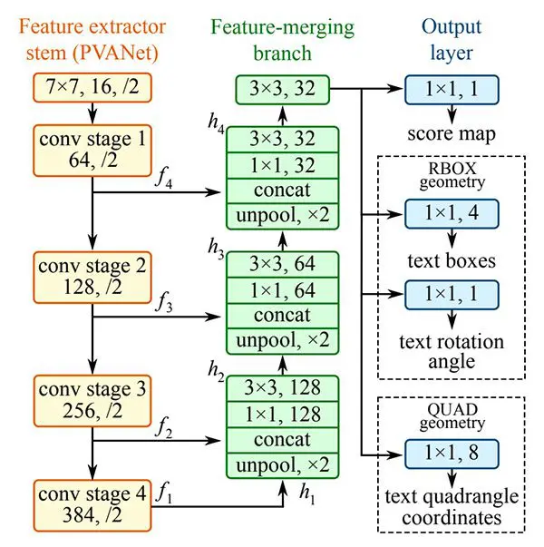
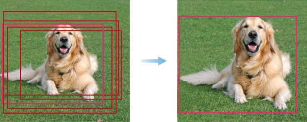

# EAST

**EAST (Efficient and Accurate Scene Text Detector)** ra đời năm 2017 là một **bước ngoặt** trong lĩnh vực Text Detection. Trước đây, các phương pháp thường bao gồm nhiều giai đoạn phức tạp, EAST đã **đơn giản hóa** mọi thứ thành một mạng **FCN (Fully Convolutional Network)** duy nhất, dự đoán **trực tiếp** các hộp văn bản (word/line level) từ ảnh đầu vào

  

## Kiến trúc tổng quan
Luồng xử lý của EAST rất trực quan, đi theo **kiến trúc hình chữ U**, bao gồm 3 phần chính:

* **Feature Extractor Stem**: Sử dụng mạng CNN (PVANet, ResNet hoặc VGG) để trích xuất đặc trưng ảnh
* **Feature-Merging Branch**: Kết hợp các đặc trưng tầng cao (ngữ nghĩa) và tầng thấp (chi tiết) để phát hiện chữ ở nhiều kích thước khác nhau
* **Output Layer**: Dự đoán Score map và Geometry map

Sau đây ta sẽ đi vào từng phần cụ thể

### 1. Feature Extractor Stem

Mạng sử dụng một **backbone pre-trained** (ví dụ PVANet) trên ImageNet. Nó sẽ trích xuất 4 tầng đặc trưng ($f_i$) với kích thước giảm dần:
* $f_1$: $\frac{1}{4}$ kích thước ảnh gốc
* $f_2$: $\frac{1}{8}$ kích thước ảnh gốc
* $f_3$: $\frac{1}{16}$ kích thước ảnh gốc
* $f_4$: $\frac{1}{32}$ kích thước ảnh gốc

  

### 2. Feature-Merging Branch

Để phát hiện chữ nhỏ (cần chi tiết) và chữ lớn (cần ngữ nghĩa), EAST gộp các đặc trưng theo **quy trình ngược (Upsampling)**. Công thức gộp đặc trưng tại mỗi bước như sau:
$$h_i = \begin{cases} 
f_i & \text{nếu } i = 1 \\
\text{conv}_{3\times3}(\text{conv}_{1\times1}([\text{unpool}(h_{i-1}); f_i])) & \text{nếu } i \ge 2 
\end{cases}$$

Trong đó:
* unpool: Phóng to đặc trưng tầng trên gấp đôi
* [;]: Phép nối (concatenate) đặc trưng phóng to $h_{i-1}$ với đặc trưng $f_i$ cùng kích thước
* conv1x1: Giảm số kênh (channels) để giảm chi phí tính toán
* conv3x3: Trộn thông tin để tạo ra đặc trưng mới $h_i$

Kết quả cuối cùng của sẽ là đặc trưng có kích thước bằng $\frac{1}{4}$ ảnh gốc

### 3. Output Layer
Đây là phần **trí tuệ** nhất của EAST. Mạng không chỉ nói "đây là chữ", mà còn vẽ một cái hộp **bao quanh nó**. Đầu ra bao gồm các **bản đồ (maps)** sau:

#### Score Map
* Số kênh: 1
* Ý nghĩa: Mỗi pixel trên bản đồ này có giá trị từ $[0, 1]$, biểu thị **xác suất** pixel nằm trong **một vùng văn bản**

#### Geometry Map 
EAST hỗ trợ 2 loại bản đồ hình học: **RBOX** (Rotated Box - Hộp xoay) và **QUAD** (Quadrangle - Tứ giác). Trong thực tế, RBOX phổ biến và hiệu quả hơn. Với RBOX, Để vẽ một hộp xoay quanh một pixel $(x, y)$ đang xét, mạng sẽ dự đoán **5 giá trị** (ứng với đầu ra 5 kênh):
* Khoảng cách (AABB): Khoảng cách từ pixel đó đến 4 cạnh của hình chữ nhật bao quanh: Top ($d_1$), Right ($d_2$), Bottom ($d_3$), Left ($d_4$). Tập hợp $R = \{d_1, d_2, d_3, d_4\}$
* Góc xoay ($\theta$): Góc nghiêng của hộp văn bản

Vậy tổng cộng đầu ra là một tensor có kích thước $(H/4, W/4, 6)$ (1 kênh Score + 5 kênh RBOX)

### 4. Label Generation
CÓ một vấn đề là nếu hai dòng chữ nằm sát nhau, các pixel ở biên rất dễ bị **chồng chéo**, khiến mạng khó phân tách. Vậy phải làm sao để dạy mạng biết đâu là tâm của hộp chữ? EAST sử dụng một kỹ thuật để **co nhỏ** vùng văn bản: vùng Score Map dương tính thực tế là một phiên bản "co nhỏ" của hộp chữ gốc (khoảng 0.3 lần cạnh ngắn nhất), giúp tách biệt các vùng văn bản dính liền nhau

## Hàm mất mát
Việc huấn luyện EAST dựa trên việc tối ưu hóa hàm **loss tổng hợp**:
$$L = L_s + \lambda_g L_g$$

Trong đó $L_s$ là loss cho Score map và $L_g$ là loss cho Geometry map. Ở đây $\lambda_g$ là trọng số đánh giá **mức độ quan trọng** giữa hai loại loss, EAST gốc mặc định $\lambda_g=1$ 

### Loss cho Score Map ($L_s$)
Để giải quyết vấn đề lớn nhất lúc đó là sự **mất cân bằng dữ liệu** (số pixel nền nhiều hơn rất nhiều số pixel chữ). EAST sử dụng **Class-balanced Cross-entropy**:
$$L_s = -\beta Y^* \log(\hat{Y}) - (1-\beta)(1-Y^*) \log(1-\hat{Y})$$

Trong đó $hat{Y}$ là dự đoán của score map, $Y*{*}$ là giá trị thực và $\beta$ là **hệ số cân bằng**, được tính dựa trên tỷ lệ số lượng pixel chữ (positive) và nền (negative), cho bởi công thức:
$$\beta \;=\; 1 - \frac{\sum_{y^* \in Y^*}y^*}{\lvert Y^*\rvert}$$

### Loss cho Geometry ($L_g$)
Đây là phần giúp EAST dự đoán hộp chính xác bất kể kích thước chữ to hay nhỏ (**Scale-invariant**). Với RBOX, loss được chia làm hai phần nhỏ:
#### AABB Loss: 
* Thay vì dùng L1/L2 loss (dễ bị bias theo vật thể to), EAST dùng **IoU Loss (Intersection over Union)** giữa $\hat{R} = \{\hat{d_1}, \hat{d_2}, \hat{d_3}, \hat{d_4}\}$ là giá trị đầu ra dự đoán của geometry map và $R^* = \{d_1^*, d_2^*, d_3^*, d_4^*\}$ là giá trị thực
$$L_{AABB} = -\log(\text{IoU}(\hat{R}, R^*)) = -\log\!\left(
\frac{\lvert \hat{R} \cap R^* \rvert}{
\lvert \hat{R} \cup R^* \rvert}
\right) = -\log\left(\frac{\text{Intersection Area}}{\text{Union Area}}\right)$$
* Diện tích phần giao (Intersection) và phần hợp (Union) có thể được tính **cực nhanh** nhờ 4 khoảng cách dự đoán
$$\lvert \hat{R} \cap R^* \rvert = (\min(\hat{d_1}, d_1^*) + \min(\hat{d_3}, d_3^*)) \times (\min(\hat{d_2}, d_2^*) + \min(\hat{d_4}, d_4^*))$$

$$\lvert \hat{R} \cup R^* \rvert = \lvert \hat{R} \rvert + \lvert R^* \rvert - \lvert \hat{R} \cup R^* \rvert$$

#### Angle Loss: 
* Sử dụng hàm cosine để tính sai số góc
$$L_{\theta}(\hat{\theta}, \theta^*) = 1 - \cos(\hat{\theta} - \theta^*)$$

Như vậy tổng Geometry Loss sẽ là: $L_g = L_{AABB} + \lambda_{\theta} L_{\theta}$ (mặc định $\lambda_{\theta} = 10$)

## Hậu xử lý
**Hậu xử lý (postprocessing)** thường là phần bị bỏ qua nhưng lại là **yếu tố quyết định** của mô hình. Giẳ sử với một bức ảnh kích thước $512 \times 512$, kể cả sau khi EAST giảm kích thước xuống 4 lần ($128 \times 128$), ta vẫn còn có tới hơn **16,000 pixel**. Điều này đồng nghĩa với việc ta có hàng nghìn hộp dự đoán **chồng chéo lên** nhau cho cùng một dòng chữ. Chúng ta cần một **bộ lọc** để giữ lại hộp tốt nhất và loại bỏ các hộp dư thừa. Kỹ thuật đó gọi là **NMS (Non-Maximum Suppression)**

  

### Non-Maximum Suppression
Non-Maximum Suppression (Triệt tiêu không cực đại) là **thuật toán kinh điển** trong bài toán Object Detection. Hãy tưởng tượng bạn chụp 100 tấm ảnh của cùng một người ở cùng một vị trí, NMS là người biên tập viên sẽ chọn ra 1 tấm đẹp nhất và vứt bỏ 99 tấm còn lại. Cách hoạt động của NMS truyền thống:
* **Sắp xếp**: Xếp tất cả các hộp dự đoán theo điểm tin cậy (Score) từ cao xuống thấp
* **Lựa chọn**: Lấy hộp có điểm cao nhất (gọi là $A$) làm hộp chuẩn
* **So sánh & Loại bỏ**: So sánh $A$ với tất cả các hộp còn lại. Nếu hộp nào chồng lấn (overlap) quá nhiều với $A$, ta coi nó là bản sao kém hơn và xóa nó đi
* **Lặp lại**: Tiếp tục với hộp có điểm cao nhất tiếp theo trong số những hộp chưa bị xóa

Để biết hai hộp có "trùng nhau" nhiều hay không, ta dùng chỉ số IoU:
$$\text{IoU}(A, B) = 
\frac{\lvert A \cap B \rvert}{
\lvert A \cup B \rvert} = \frac{\text{Intersection Area}}{\text{Union Area}}$$

Nếu $\text{IoU} > \alpha$ ($\alpha$ là một ngưỡng cụ thể nào đó, ví dụ $0.5$), ta coi là trùng nhau và xóa hộp điểm thấp hơn

### Locality-Aware NMS
Tuy hiệu quả, nhưng NMS truyền thống có điểm yếu chí mạng: **tốc độ**. Độ phức tạp thuật toán của nó là $O(n^2)$, trong đó $n$ là số lượng hộp dự đoán. Với EAST, $n$ lên tới **hàng chục nghìn** (dense predictions). Việc so sánh từng cặp hộp sẽ khiến thuật toán chạy rất chậm, làm mất đi ưu thế tốc độ của mạng FCN.

Vậy nên các tác giả của EAST đã suy nghĩ và nhận thấy một quy luật thú vị: các pixel nằm cạnh nhau thường dự đoán cùng một dòng chữ. Thay vì so sánh lung tung tất cả các hộp với nhau, tại sao không gộp (merge) các hộp hàng xóm lại? Đó là ý tưởng của **Locality-Aware NMS**

#### Row-by-row Merging
Thay vì xử lý toàn bộ ảnh cùng lúc, EAST duyệt qua các hộp dự đoán **theo từng hàng**
* Duyệt từ trái sang phải trên một hàng
* Nếu hộp hiện tại ($g$) và hộp vừa được gộp trước đó ($p$) có độ chồng lấn cao, ta sẽ **gộp** chúng lại thành một hộp mới, thay vì xóa bỏ hộp $g$
* Tiếp tục quá trình này cho đến hết hàng, sau đó chuyển sang hàng tiếp theo

Độ phức tạp giảm xuống chỉ còn $O(n)$ trong **trường hợp tốt nhất**

#### Weighted Merge
Khác với NMS truyền thống hoạt động theo kiểu **được ăn cả, ngã về không** (chọn hộp tốt nhất, xóa hộp kia), EAST hoạt động theo cơ chế **bỏ phiếu**. Khi gộp 2 hộp $g$ (hộp hiện tại) và $p$ (hộp trước đó), tọa độ của hộp mới không phải là tọa độ của hộp điểm cao hơn, mà là **trung bình cộng có trọng số** dựa trên điểm tin cậy (score) của chúng.

Giả sử hộp $g$ có điểm số $V(g)$ và tọa độ $g_i$. Hộp $p$ có điểm số $V(p)$ và tọa độ $p_i$. Tọa độ hộp mới $a_i$ và điểm số mới của hộp gộp sẽ là:
$$a_i = \frac{V(g) \cdot g_i + V(p) \cdot p_i}{V(g) + V(p)}$$
$$V(a) = V(g) + V(p)$$

Tác dụng của việc gộp có trọng số:
* **Chính xác (Accuracy)**: Hộp kết quả là sự tổng hợp "trí tuệ" của nhiều pixel dự đoán, nên nó bao quanh chữ khít hơn so với chỉ dùng 1 pixel đơn lẻ
* **Ổn định (Stability)**: Khi áp dụng vào video, cơ chế này giúp hộp **không bị rung lắc** (jitter) giữa các frame hình, vì nó là kết quả trung bình chứ không phải là sự lựa chọn ngẫu nhiên giữa các hộp xấp xỉ nhau

## Ví dụ minh họa

## Tài liệu tham khảo
https://arxiv.org/abs/1704.03155
https://github.com/weinman/MapTD
https://github.com/argman/EAST
https://github.com/janzd/EAST
https://github.com/foamliu/EAST
https://pyimagesearch.com/2018/08/20/opencv-text-detection-east-text-detector/
https://github.com/SakuraRiven/LANMS
https://stackoverflow.com/questions/55583306/decoding-geometry-output-of-east-text-detection

EAST/
│
├── configs/                        
│   ├── east_config.yaml            
│
├── data/                          
│   ├── dataset.py                
│   ├── transformations.py         
│   └── geometry_utils.py          
│
├── models/                       
│   ├── clanms/             
│   ├── pylanms.py                   
│   ├── backbone.py                   
│   ├── east.py                   
│   └── loss.py                  
│
├── utils/                        
│   ├── evaluation.py              
│   ├── visualization.py            
│   └── checkpoint.py            
│
├── scripts/                       
│   ├── train.py                   
│   ├── eval.py                     